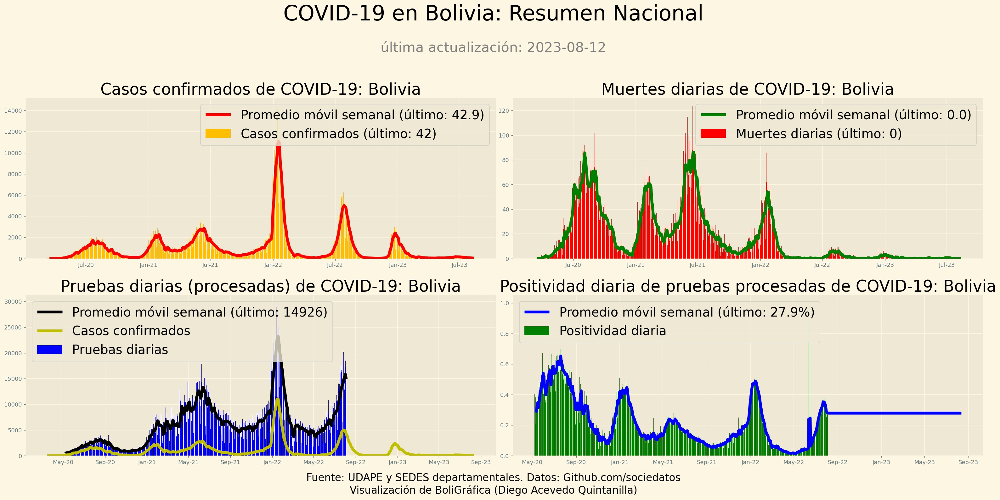

Datos COVID-19 en Bolivia.

**Fuentes principales**:

-UDAPE vía Mauricio Foronda (@mauforonda) https://github.com/mauforonda/covid19-bolivia-udape
-SEDES departamentales vía Eduardo Arraya (@arraya_eduardo) https://github.com/pr0nstar/covid19-data

Gráficas de Diego Acevedo Quintanilla (CEO CFO BoliGráfica)

